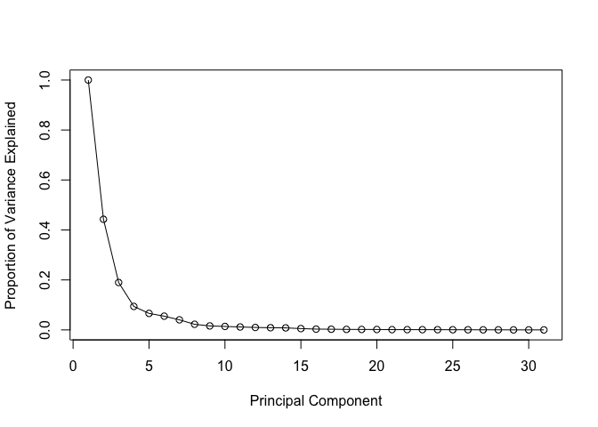
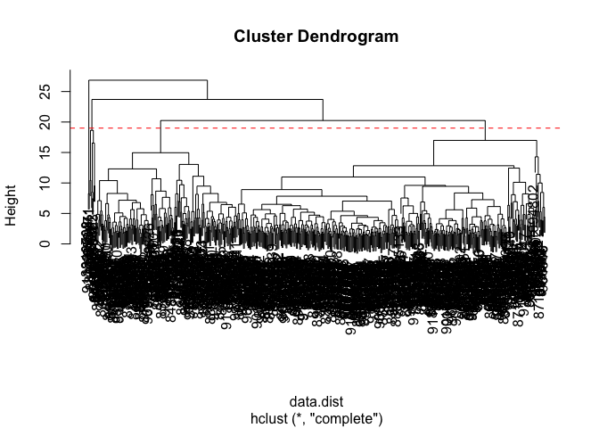

# Class 8: Breast Cancer Mini Project
Cyrus Shabahang (PID: A19145663)

- [Background](#background)
- [Hierarchical Clustering](#hierarchical-clustering)
- [Results of Hierarchical
  Clustering](#results-of-hierarchical-clustering)
- [Combining methods](#combining-methods)
- [Prediction](#prediction)

## Background

In today’s class we will be employing all the R techniques for data
analysis that we have learned thus far - including the machine learning
methods of clustering and PCA - to analyze real breast cancer biopsy
data.

``` r
fna.data <- "WisconsinCancer.csv"
wisc.df <- read.csv(fna.data, row.names=1)
```

``` r
head(wisc.df, 3)
```

             diagnosis radius_mean texture_mean perimeter_mean area_mean
    842302           M       17.99        10.38          122.8      1001
    842517           M       20.57        17.77          132.9      1326
    84300903         M       19.69        21.25          130.0      1203
             smoothness_mean compactness_mean concavity_mean concave.points_mean
    842302           0.11840          0.27760         0.3001             0.14710
    842517           0.08474          0.07864         0.0869             0.07017
    84300903         0.10960          0.15990         0.1974             0.12790
             symmetry_mean fractal_dimension_mean radius_se texture_se perimeter_se
    842302          0.2419                0.07871    1.0950     0.9053        8.589
    842517          0.1812                0.05667    0.5435     0.7339        3.398
    84300903        0.2069                0.05999    0.7456     0.7869        4.585
             area_se smoothness_se compactness_se concavity_se concave.points_se
    842302    153.40      0.006399        0.04904      0.05373           0.01587
    842517     74.08      0.005225        0.01308      0.01860           0.01340
    84300903   94.03      0.006150        0.04006      0.03832           0.02058
             symmetry_se fractal_dimension_se radius_worst texture_worst
    842302       0.03003             0.006193        25.38         17.33
    842517       0.01389             0.003532        24.99         23.41
    84300903     0.02250             0.004571        23.57         25.53
             perimeter_worst area_worst smoothness_worst compactness_worst
    842302             184.6       2019           0.1622            0.6656
    842517             158.8       1956           0.1238            0.1866
    84300903           152.5       1709           0.1444            0.4245
             concavity_worst concave.points_worst symmetry_worst
    842302            0.7119               0.2654         0.4601
    842517            0.2416               0.1860         0.2750
    84300903          0.4504               0.2430         0.3613
             fractal_dimension_worst
    842302                   0.11890
    842517                   0.08902
    84300903                 0.08758

> Q1. How many observations are in this dataset?

``` r
nrow(wisc.df)
```

    [1] 569

569 observations

> Q2. How many of the observations have a malignant diagnosis?

``` r
sum(wisc.df$diagnosis == "M")
```

    [1] 212

212 have a malignant diagnosis

> Q3. How many variables/features in the data are suffixed with \_mean?

``` r
colnames(wisc.df)
```

     [1] "diagnosis"               "radius_mean"            
     [3] "texture_mean"            "perimeter_mean"         
     [5] "area_mean"               "smoothness_mean"        
     [7] "compactness_mean"        "concavity_mean"         
     [9] "concave.points_mean"     "symmetry_mean"          
    [11] "fractal_dimension_mean"  "radius_se"              
    [13] "texture_se"              "perimeter_se"           
    [15] "area_se"                 "smoothness_se"          
    [17] "compactness_se"          "concavity_se"           
    [19] "concave.points_se"       "symmetry_se"            
    [21] "fractal_dimension_se"    "radius_worst"           
    [23] "texture_worst"           "perimeter_worst"        
    [25] "area_worst"              "smoothness_worst"       
    [27] "compactness_worst"       "concavity_worst"        
    [29] "concave.points_worst"    "symmetry_worst"         
    [31] "fractal_dimension_worst"

``` r
length(grep("mean$", colnames(wisc.df), value = TRUE))
```

    [1] 10

10 are suffixed with \_mean

We need to remove the `diagnosis` column before we do any further
analysis of this dataset - we don’t want to pass this to PCA etc. We
will save it as a seperate vector that we can use later to compare our
findings to those of experts.

``` r
# We can use -1 here to remove the first column
wisc.data <- wisc.df[,-1]
diagnosis <- wisc.df$diagnosis
```

> Q4. From your results, what proportion of the original variance is
> captured by the first principal component (PC1)?

44.27%

> Q5. How many principal components (PCs) are required to describe at
> least 70% of the original variance in the data?

3 PCs

> Q6. How many principal components (PCs) are required to describe at
> least 90% of the original variance in the data? \## Principal
> Component Analysis (PCA)

7 PCs

``` r
wisc.pr <- prcomp(wisc.data, scale. = TRUE)
summary(wisc.pr)
```

    Importance of components:
                              PC1    PC2     PC3     PC4     PC5     PC6     PC7
    Standard deviation     3.6444 2.3857 1.67867 1.40735 1.28403 1.09880 0.82172
    Proportion of Variance 0.4427 0.1897 0.09393 0.06602 0.05496 0.04025 0.02251
    Cumulative Proportion  0.4427 0.6324 0.72636 0.79239 0.84734 0.88759 0.91010
                               PC8    PC9    PC10   PC11    PC12    PC13    PC14
    Standard deviation     0.69037 0.6457 0.59219 0.5421 0.51104 0.49128 0.39624
    Proportion of Variance 0.01589 0.0139 0.01169 0.0098 0.00871 0.00805 0.00523
    Cumulative Proportion  0.92598 0.9399 0.95157 0.9614 0.97007 0.97812 0.98335
                              PC15    PC16    PC17    PC18    PC19    PC20   PC21
    Standard deviation     0.30681 0.28260 0.24372 0.22939 0.22244 0.17652 0.1731
    Proportion of Variance 0.00314 0.00266 0.00198 0.00175 0.00165 0.00104 0.0010
    Cumulative Proportion  0.98649 0.98915 0.99113 0.99288 0.99453 0.99557 0.9966
                              PC22    PC23   PC24    PC25    PC26    PC27    PC28
    Standard deviation     0.16565 0.15602 0.1344 0.12442 0.09043 0.08307 0.03987
    Proportion of Variance 0.00091 0.00081 0.0006 0.00052 0.00027 0.00023 0.00005
    Cumulative Proportion  0.99749 0.99830 0.9989 0.99942 0.99969 0.99992 0.99997
                              PC29    PC30
    Standard deviation     0.02736 0.01153
    Proportion of Variance 0.00002 0.00000
    Cumulative Proportion  1.00000 1.00000

``` r
diagnosis <- as.factor(wisc.df$diagnosis)
biplot(wisc.pr)
```


> Q7. What stands out to you about this plot? Is it easy or difficult to
> understand? Why?

This plot is very difficul to read and there are various overlapping
points and labels.

The main function in base R is called `prcomp()`

The next step in the analysis is to perform principal component analysis
(PCA) on wisc.data.

``` r
colMeans(wisc.data)
```

                radius_mean            texture_mean          perimeter_mean 
               1.412729e+01            1.928965e+01            9.196903e+01 
                  area_mean         smoothness_mean        compactness_mean 
               6.548891e+02            9.636028e-02            1.043410e-01 
             concavity_mean     concave.points_mean           symmetry_mean 
               8.879932e-02            4.891915e-02            1.811619e-01 
     fractal_dimension_mean               radius_se              texture_se 
               6.279761e-02            4.051721e-01            1.216853e+00 
               perimeter_se                 area_se           smoothness_se 
               2.866059e+00            4.033708e+01            7.040979e-03 
             compactness_se            concavity_se       concave.points_se 
               2.547814e-02            3.189372e-02            1.179614e-02 
                symmetry_se    fractal_dimension_se            radius_worst 
               2.054230e-02            3.794904e-03            1.626919e+01 
              texture_worst         perimeter_worst              area_worst 
               2.567722e+01            1.072612e+02            8.805831e+02 
           smoothness_worst       compactness_worst         concavity_worst 
               1.323686e-01            2.542650e-01            2.721885e-01 
       concave.points_worst          symmetry_worst fractal_dimension_worst 
               1.146062e-01            2.900756e-01            8.394582e-02 

``` r
apply(wisc.data,2,sd)
```

                radius_mean            texture_mean          perimeter_mean 
               3.524049e+00            4.301036e+00            2.429898e+01 
                  area_mean         smoothness_mean        compactness_mean 
               3.519141e+02            1.406413e-02            5.281276e-02 
             concavity_mean     concave.points_mean           symmetry_mean 
               7.971981e-02            3.880284e-02            2.741428e-02 
     fractal_dimension_mean               radius_se              texture_se 
               7.060363e-03            2.773127e-01            5.516484e-01 
               perimeter_se                 area_se           smoothness_se 
               2.021855e+00            4.549101e+01            3.002518e-03 
             compactness_se            concavity_se       concave.points_se 
               1.790818e-02            3.018606e-02            6.170285e-03 
                symmetry_se    fractal_dimension_se            radius_worst 
               8.266372e-03            2.646071e-03            4.833242e+00 
              texture_worst         perimeter_worst              area_worst 
               6.146258e+00            3.360254e+01            5.693570e+02 
           smoothness_worst       compactness_worst         concavity_worst 
               2.283243e-02            1.573365e-01            2.086243e-01 
       concave.points_worst          symmetry_worst fractal_dimension_worst 
               6.573234e-02            6.186747e-02            1.806127e-02 

\##Execute PCA with the `prcomp()`

``` r
wisc.pr <- prcomp(wisc.data, scale = TRUE)
summary(wisc.pr)
```

    Importance of components:
                              PC1    PC2     PC3     PC4     PC5     PC6     PC7
    Standard deviation     3.6444 2.3857 1.67867 1.40735 1.28403 1.09880 0.82172
    Proportion of Variance 0.4427 0.1897 0.09393 0.06602 0.05496 0.04025 0.02251
    Cumulative Proportion  0.4427 0.6324 0.72636 0.79239 0.84734 0.88759 0.91010
                               PC8    PC9    PC10   PC11    PC12    PC13    PC14
    Standard deviation     0.69037 0.6457 0.59219 0.5421 0.51104 0.49128 0.39624
    Proportion of Variance 0.01589 0.0139 0.01169 0.0098 0.00871 0.00805 0.00523
    Cumulative Proportion  0.92598 0.9399 0.95157 0.9614 0.97007 0.97812 0.98335
                              PC15    PC16    PC17    PC18    PC19    PC20   PC21
    Standard deviation     0.30681 0.28260 0.24372 0.22939 0.22244 0.17652 0.1731
    Proportion of Variance 0.00314 0.00266 0.00198 0.00175 0.00165 0.00104 0.0010
    Cumulative Proportion  0.98649 0.98915 0.99113 0.99288 0.99453 0.99557 0.9966
                              PC22    PC23   PC24    PC25    PC26    PC27    PC28
    Standard deviation     0.16565 0.15602 0.1344 0.12442 0.09043 0.08307 0.03987
    Proportion of Variance 0.00091 0.00081 0.0006 0.00052 0.00027 0.00023 0.00005
    Cumulative Proportion  0.99749 0.99830 0.9989 0.99942 0.99969 0.99992 0.99997
                              PC29    PC30
    Standard deviation     0.02736 0.01153
    Proportion of Variance 0.00002 0.00000
    Cumulative Proportion  1.00000 1.00000

``` r
attributes(wisc.pr)
```

    $names
    [1] "sdev"     "rotation" "center"   "scale"    "x"       

    $class
    [1] "prcomp"

``` r
library(ggplot2)

ggplot(wisc.pr$x) +
  aes(PC1, PC2, col = diagnosis) +
  geom_point()
```


``` r
ggplot(wisc.pr$x) +
  aes(PC1, PC3, col=diagnosis) +
  geom_point()
```


> Q8. Generate a similar plot for principal components 1 and 3. What do
> you notice about these plots?

PC1 shows the main separation between malignant and benign. PC2 and PC3
added some spread but not as good as PC1.

``` r
pr.var <- wisc.pr$sdev^2
head(pr.var)
```

    [1] 13.281608  5.691355  2.817949  1.980640  1.648731  1.207357

``` r
# Variance explained by each principal component: pve
pve <- pr.var / sum(pr.var) 

# Plot variance explained for each principal component
plot(c(1,pve), xlab = "Principal Component", 
     ylab = "Proportion of Variance Explained", 
     ylim = c(0, 1), type = "o")
```



> Q9. For the first principal component, what is the component of the
> loading vector (i.e. wisc.pr\$rotation\[,1\]) for the feature
> concave.points_mean? This tells us how much this original feature
> contributes to the first PC. Are there any features with larger
> contributions than this one?

``` r
wisc.pr$rotation["concave.points_mean", 1]
```

    [1] -0.2608538

``` r
sort(wisc.pr$rotation[,1], decreasing = TRUE)[1:10]
```

              smoothness_se              texture_se             symmetry_se 
                -0.01453145             -0.01742803             -0.04249842 
     fractal_dimension_mean    fractal_dimension_se            texture_mean 
                -0.06436335             -0.10256832             -0.10372458 
              texture_worst          symmetry_worst        smoothness_worst 
                -0.10446933             -0.12290456             -0.12795256 
    fractal_dimension_worst 
                -0.13178394 

``` r
sort(wisc.pr$rotation[,1], decreasing = FALSE)[1:10]
```

     concave.points_mean       concavity_mean concave.points_worst 
              -0.2608538           -0.2584005           -0.2508860 
        compactness_mean      perimeter_worst      concavity_worst 
              -0.2392854           -0.2366397           -0.2287675 
            radius_worst       perimeter_mean           area_worst 
              -0.2279966           -0.2275373           -0.2248705 
               area_mean 
              -0.2209950 

The component of the loading vector is -0.26. Yes there are featuers
with larger contributions than this one.

``` r
# Alternative scree plot of the same data, note data driven y-axis
barplot(pve, ylab = "Percent of Variance Explained",
     names.arg=paste0("PC",1:length(pve)), las=2, axes = FALSE)
axis(2, at=pve, labels=round(pve,2)*100 )
```


> Q4. From your results, what proportion of the original variance is
> captured by the first principal component (PC1)?

> Q5. How many principal components (PCs) are required to describe at
> least 70% of the original variance in the data?

> Q6. How many principal components (PCs) are required to describe at
> least 90% of the original variance in the data?

## Hierarchical Clustering

``` r
data.scaled <- scale(wisc.data)
data.dist <- dist(data.scaled)
wisc.hclust <- hclust(data.dist, method = "complete")
```

## Results of Hierarchical Clustering

``` r
plot(wisc.hclust)
abline(h = 19, col="red", lty=2)
```



> Q10. Using the plot() and abline() functions, what is the height at
> which the clustering model has 4 clusters?

The height at which the clustering model has 4 clusters is a height of
19.

## Combining methods

The idea here is that I can take my new variables (i.e. the scores on
the PCs `wisc.pr$x`) that are better descriptors of the data-set than
the original featuers (i.e. the 30 columns in `wisc.data`) and use these
as a basis for clustering.

Clustering on PCA results…

``` r
pc.dist <- dist(wisc.pr$x[ ,1:3])
wisc.pr.hclust <- hclust(pc.dist, method = "ward.D2")
plot(wisc.pr.hclust)
```


> Q12. Which method gives your favorite results for the same data.dist
> dataset? Explain your reasoning.

The method I liked better was ward.D2 because I liked the way it
separated the clusters more.

``` r
grps <- cutree(wisc.pr.hclust, k=2)
table(grps)
```

    grps
      1   2 
    203 366 

``` r
table(diagnosis)
```

    diagnosis
      B   M 
    357 212 

I can now run `table()` with both of my clustering `grps` and the expert
`diagnosis`

``` r
table(grps, diagnosis)
```

        diagnosis
    grps   B   M
       1  24 179
       2 333  33

Our cluster “1” has 179 “M” diagnosis Our cluster “2” has 333 “B”
diagnosis

179 (True-positive) 24 (False-positive) 333 (True-negative) 33
(False-negative)

Sensitivity: TP/(TP+FN)

``` r
179/(179+33)
```

    [1] 0.8443396

Specificity: TN/(TN+FP)

``` r
333/(333+24)
```

    [1] 0.9327731

``` r
ggplot(wisc.pr$x) +
  aes(PC1, PC2) +
  geom_point(col=grps)
```


> Q13. How well does the newly created hclust model with two clusters
> separate out the two “M” and “B” diagnoses?

The newly created hclust model diagnoses well. One of the clusers was
mostly malignant while the other was mostly benign. There were some
wrong groupings but overall it was separated well.

> Q14. How well do the hierarchical clustering models you created in the
> previous sections (i.e. without first doing PCA) do in terms of
> separating the diagnoses? Again, use the table() function to compare
> the output of each model (wisc.hclust.clusters and
> wisc.pr.hclust.clusters) with the vector containing the actual
> diagnoses.

The cluster model that didn’t use PCA seemed to be more mixed. The PCA
with ward.D2 gave a better two grouped split.

## Prediction

We can use our PCA model for prediction of new un-seen cases:

``` r
#url <- "new_samples.csv"
url <- "https://tinyurl.com/new-samples-CSV"
new <- read.csv(url)
npc <- predict(wisc.pr, newdata=new)
npc
```

               PC1       PC2        PC3        PC4       PC5        PC6        PC7
    [1,]  2.576616 -3.135913  1.3990492 -0.7631950  2.781648 -0.8150185 -0.3959098
    [2,] -4.754928 -3.009033 -0.1660946 -0.6052952 -1.140698 -1.2189945  0.8193031
                PC8       PC9       PC10      PC11      PC12      PC13     PC14
    [1,] -0.2307350 0.1029569 -0.9272861 0.3411457  0.375921 0.1610764 1.187882
    [2,] -0.3307423 0.5281896 -0.4855301 0.7173233 -1.185917 0.5893856 0.303029
              PC15       PC16        PC17        PC18        PC19       PC20
    [1,] 0.3216974 -0.1743616 -0.07875393 -0.11207028 -0.08802955 -0.2495216
    [2,] 0.1299153  0.1448061 -0.40509706  0.06565549  0.25591230 -0.4289500
               PC21       PC22       PC23       PC24        PC25         PC26
    [1,]  0.1228233 0.09358453 0.08347651  0.1223396  0.02124121  0.078884581
    [2,] -0.1224776 0.01732146 0.06316631 -0.2338618 -0.20755948 -0.009833238
                 PC27        PC28         PC29         PC30
    [1,]  0.220199544 -0.02946023 -0.015620933  0.005269029
    [2,] -0.001134152  0.09638361  0.002795349 -0.019015820

``` r
plot(wisc.pr$x[,1:2], col=grps)
points(npc[,1], npc[,2], col="blue", pch=16, cex=3)
text(npc[,1], npc[,2], c(1,2), col="white")
```


> Q16. Which of these new patients should we prioritize for follow up
> based on your results?

We should prioritize patient 1 for a follow-up since patient 2 looks
more benign.
