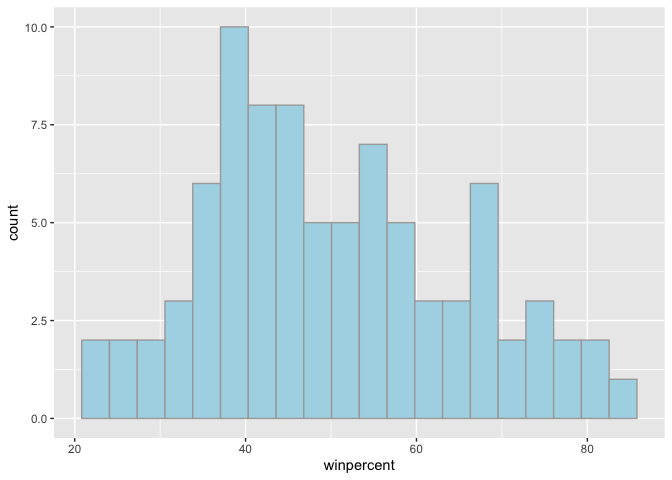
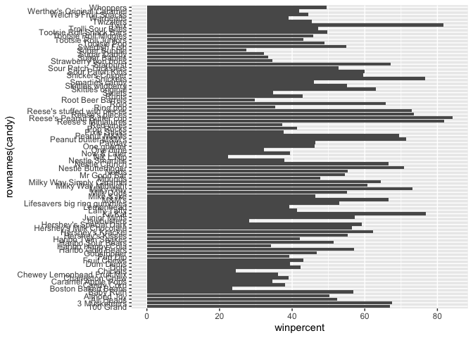
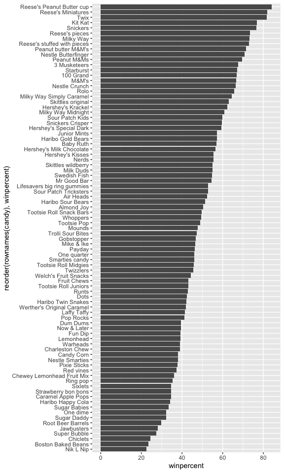
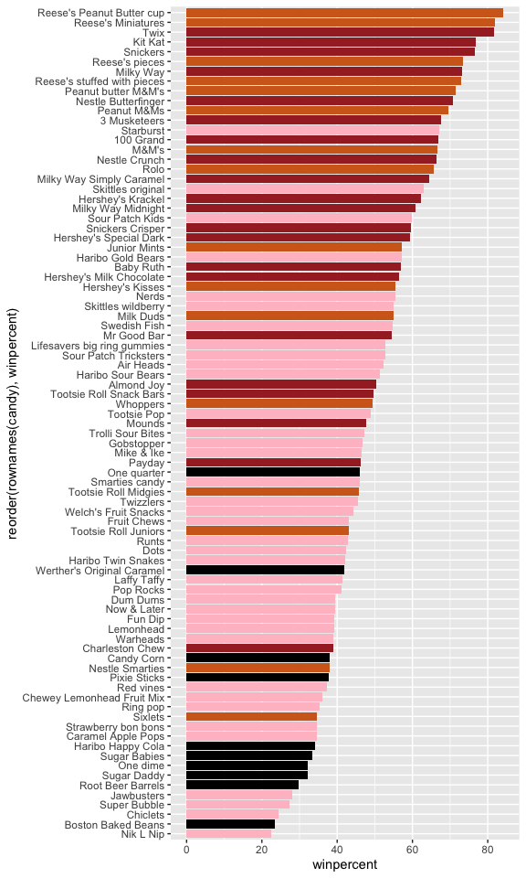
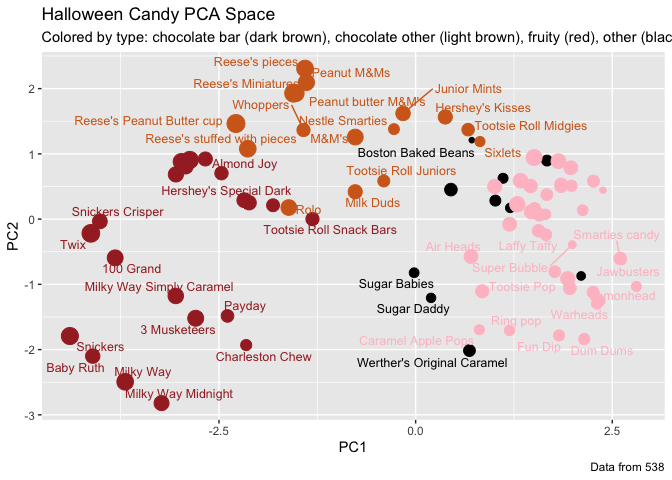
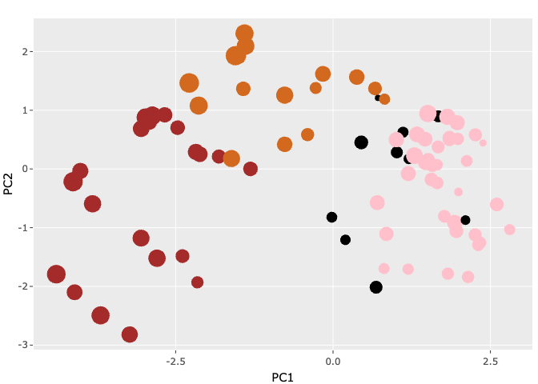

# Class 09: Candy Mini Project
Cyrus Shabahang (PID: A19145663)

- [Background](#background)
- [Data Import](#data-import)
- [Exploratory Analysis](#exploratory-analysis)
- [Overall Candy Rankings](#overall-candy-rankings)
- [Exploring the correlation
  structure](#exploring-the-correlation-structure)
- [Principal Component Analysis](#principal-component-analysis)

## Background

In today’s mini-project we will analyze candy data with ggplot, basic
statistics, correlation analysis and principal component analysis
methods we have been learning thus far.

## Data Import

The data comes as a CSV file from 538.

``` r
candy <- read.csv("candy-data.csv", row.names = 1)
head(candy)
```

                 chocolate fruity caramel peanutyalmondy nougat crispedricewafer
    100 Grand            1      0       1              0      0                1
    3 Musketeers         1      0       0              0      1                0
    One dime             0      0       0              0      0                0
    One quarter          0      0       0              0      0                0
    Air Heads            0      1       0              0      0                0
    Almond Joy           1      0       0              1      0                0
                 hard bar pluribus sugarpercent pricepercent winpercent
    100 Grand       0   1        0        0.732        0.860   66.97173
    3 Musketeers    0   1        0        0.604        0.511   67.60294
    One dime        0   0        0        0.011        0.116   32.26109
    One quarter     0   0        0        0.011        0.511   46.11650
    Air Heads       0   0        0        0.906        0.511   52.34146
    Almond Joy      0   1        0        0.465        0.767   50.34755

> Q1. How many different candy types are in this dataset?

There are 85 rows in this dataset.

> Q2. How many fruity candy types are in the dataset?

``` r
sum(candy$fruity)
```

    [1] 38

> Q3. What is your favorite candy (other than Twix) in the dataset and
> what is it’s winpercent value?

``` r
candy["Haribo Twin Snakes", ]$winpercent
```

    [1] 42.17877

> Q4. What is the winpercent value for “Kit Kat”? (Using dplyr package)

``` r
library(dplyr)
```


    Attaching package: 'dplyr'

    The following objects are masked from 'package:stats':

        filter, lag

    The following objects are masked from 'package:base':

        intersect, setdiff, setequal, union

``` r
candy |>
  filter(row.names(candy)=="Kit Kat") |>
  select(winpercent)
```

            winpercent
    Kit Kat    76.7686

> Q5. What is the winpercent value for “Tootsie Roll Snack Bars”?

``` r
candy["Tootsie Roll Snack Bars", ]$winpercent
```

    [1] 49.6535

> Q6. Is there any variable/column that looks to be on a different scale
> to the majority of the other columns in the dataset?

``` r
library("skimr")
skim(candy)
```

|                                                  |       |
|:-------------------------------------------------|:------|
| Name                                             | candy |
| Number of rows                                   | 85    |
| Number of columns                                | 12    |
| \_\_\_\_\_\_\_\_\_\_\_\_\_\_\_\_\_\_\_\_\_\_\_   |       |
| Column type frequency:                           |       |
| numeric                                          | 12    |
| \_\_\_\_\_\_\_\_\_\_\_\_\_\_\_\_\_\_\_\_\_\_\_\_ |       |
| Group variables                                  | None  |

Data summary

**Variable type: numeric**

| skim_variable | n_missing | complete_rate | mean | sd | p0 | p25 | p50 | p75 | p100 | hist |
|:---|---:|---:|---:|---:|---:|---:|---:|---:|---:|:---|
| chocolate | 0 | 1 | 0.44 | 0.50 | 0.00 | 0.00 | 0.00 | 1.00 | 1.00 | ▇▁▁▁▆ |
| fruity | 0 | 1 | 0.45 | 0.50 | 0.00 | 0.00 | 0.00 | 1.00 | 1.00 | ▇▁▁▁▆ |
| caramel | 0 | 1 | 0.16 | 0.37 | 0.00 | 0.00 | 0.00 | 0.00 | 1.00 | ▇▁▁▁▂ |
| peanutyalmondy | 0 | 1 | 0.16 | 0.37 | 0.00 | 0.00 | 0.00 | 0.00 | 1.00 | ▇▁▁▁▂ |
| nougat | 0 | 1 | 0.08 | 0.28 | 0.00 | 0.00 | 0.00 | 0.00 | 1.00 | ▇▁▁▁▁ |
| crispedricewafer | 0 | 1 | 0.08 | 0.28 | 0.00 | 0.00 | 0.00 | 0.00 | 1.00 | ▇▁▁▁▁ |
| hard | 0 | 1 | 0.18 | 0.38 | 0.00 | 0.00 | 0.00 | 0.00 | 1.00 | ▇▁▁▁▂ |
| bar | 0 | 1 | 0.25 | 0.43 | 0.00 | 0.00 | 0.00 | 0.00 | 1.00 | ▇▁▁▁▂ |
| pluribus | 0 | 1 | 0.52 | 0.50 | 0.00 | 0.00 | 1.00 | 1.00 | 1.00 | ▇▁▁▁▇ |
| sugarpercent | 0 | 1 | 0.48 | 0.28 | 0.01 | 0.22 | 0.47 | 0.73 | 0.99 | ▇▇▇▇▆ |
| pricepercent | 0 | 1 | 0.47 | 0.29 | 0.01 | 0.26 | 0.47 | 0.65 | 0.98 | ▇▇▇▇▆ |
| winpercent | 0 | 1 | 50.32 | 14.71 | 22.45 | 39.14 | 47.83 | 59.86 | 84.18 | ▃▇▆▅▂ |

Winpercent is on a 0-100 scale and is different than the others that are
mostly on 0 and 1 indicators.

> Q7. What do you think a zero and one represent for the
> candy\$chocolate column?

``` r
table(candy$chocolate)
```


     0  1 
    48 37 

Zero and one are most likely binary indicators. Zero means that the
candy does not contain chocolate and one indicates that it does contain
chocolate.

## Exploratory Analysis

> Q8. Plot a histogram of winpercent values using both base R an
> ggplot2.

``` r
hist(candy$winpercent, breaks=20)
```


``` r
library(ggplot2)

ggplot(candy) +
  aes(winpercent) +
  geom_histogram(bins=20, fill="lightblue", col="darkgray")
```



> Q9. Is the distribution of winpercent values symmetrical?

No, it is not symmtrical.

> Q10. Is the center of the distribution above or below 50%?

``` r
mean(candy$winpercent)
```

    [1] 50.31676

``` r
median(candy$winpercent)
```

    [1] 47.82975

The center of distribution is slightly below 50% taking the median
values, but a mean value of around 50% suggests a right-skewed plot.

> Q11. On average is chocolate candy higher or lower ranked than fruit
> candy?

Steps to solve this: 1. Find all chocolate candy in the dataset 2.
Extract or find their winpercent values 3. Calculate the mean of these
values 4. Find all fruity candy 5. Find their winpercent values 6.
Calculate their mean vlaue

``` r
mean(candy$winpercent[candy$chocolate==1])
```

    [1] 60.92153

``` r
mean(candy$winpercent[candy$fruity==1])
```

    [1] 44.11974

``` r
median(candy$winpercent[candy$chocolate == 1])
```

    [1] 60.8007

``` r
median(candy$winpercent[candy$fruity == 1])
```

    [1] 42.96903

On average, chocolate candy is ranked higher than fruity candies. This
is evident from the mean and median for winpercent both being around 60%
for chocolate cnady.

> Q12. Is this difference statistically significant?

``` r
choc <- candy$winpercent[as.logical(candy$chocolate)]
fruit <- candy$winpercent[as.logical(candy$fruity)]

t.test(choc, fruit)
```


        Welch Two Sample t-test

    data:  choc and fruit
    t = 6.2582, df = 68.882, p-value = 2.871e-08
    alternative hypothesis: true difference in means is not equal to 0
    95 percent confidence interval:
     11.44563 22.15795
    sample estimates:
    mean of x mean of y 
     60.92153  44.11974 

This difference is statistically significant as indicated by the
extremely small p value. A p value below 0.05 tells us that there is
statistical signifiance. Chocolate has both a higher mean and median
than fruity candies. Additionally, we have a 95% confidence interval.

## Overall Candy Rankings

> Q13. What are the five least liked candy types in this set?

``` r
head(candy[order(candy$winpercent), ], n=5)
```

                       chocolate fruity caramel peanutyalmondy nougat
    Nik L Nip                  0      1       0              0      0
    Boston Baked Beans         0      0       0              1      0
    Chiclets                   0      1       0              0      0
    Super Bubble               0      1       0              0      0
    Jawbusters                 0      1       0              0      0
                       crispedricewafer hard bar pluribus sugarpercent pricepercent
    Nik L Nip                         0    0   0        1        0.197        0.976
    Boston Baked Beans                0    0   0        1        0.313        0.511
    Chiclets                          0    0   0        1        0.046        0.325
    Super Bubble                      0    0   0        0        0.162        0.116
    Jawbusters                        0    1   0        1        0.093        0.511
                       winpercent
    Nik L Nip            22.44534
    Boston Baked Beans   23.41782
    Chiclets             24.52499
    Super Bubble         27.30386
    Jawbusters           28.12744

The five least liked candy types in this data set are Nik L Nip, Boston
Baked Beans, Chiclets, Super Bubble, and Jawbusters.

> Q14. What are the top 5 all time favorite candy types out of this set?

``` r
head(candy[order(-candy$winpercent), ], n=5)
```

                              chocolate fruity caramel peanutyalmondy nougat
    Reese's Peanut Butter cup         1      0       0              1      0
    Reese's Miniatures                1      0       0              1      0
    Twix                              1      0       1              0      0
    Kit Kat                           1      0       0              0      0
    Snickers                          1      0       1              1      1
                              crispedricewafer hard bar pluribus sugarpercent
    Reese's Peanut Butter cup                0    0   0        0        0.720
    Reese's Miniatures                       0    0   0        0        0.034
    Twix                                     1    0   1        0        0.546
    Kit Kat                                  1    0   1        0        0.313
    Snickers                                 0    0   1        0        0.546
                              pricepercent winpercent
    Reese's Peanut Butter cup        0.651   84.18029
    Reese's Miniatures               0.279   81.86626
    Twix                             0.906   81.64291
    Kit Kat                          0.511   76.76860
    Snickers                         0.651   76.67378

The top 5 favorite candy types out of this set are Reese’s Peanut Butter
cup, Reese’s Miniatures, Twix, Kit Kat and Snickers.

> Q15. Make a first barplot of candy ranking based on winpercent values.

``` r
library(ggplot2)

ggplot(candy) +
  aes(winpercent, rownames(candy)) +
  geom_col()
```



> Q16. This is quite ugly, use the reorder() function to get the bars
> sorted by winpercent?

``` r
ggplot(candy) +
  aes(winpercent, 
      reorder(rownames(candy), winpercent)) +
  geom_col()
```



``` r
  ylab("")
```

    <ggplot2::labels> List of 1
     $ y: chr ""

``` r
ggsave("barplot1.png", height=10, width=6)
```

``` r
my_cols=rep("black", nrow(candy))
my_cols[as.logical(candy$chocolate)] = "chocolate"
my_cols[as.logical(candy$bar)] = "brown"
my_cols[as.logical(candy$fruity)] = "pink"
ggplot(candy) +
  aes(winpercent, reorder(rownames(candy), winpercent)) +
  geom_col(fill=my_cols)
```



> Q17. What is the worst ranked chocolate candy?

The worst ranked chocolate candy is Sixlets.

> Q18. What is the best ranked fruity candy?

The best ranked fruity candy is Starburst.

> Q19. Which candy type is the highest ranked in terms of winpercent for
> the least money - i.e. offers the most bang for your buck?

``` r
ord <- order(candy$pricepercent, decreasing = TRUE)
head( candy[ord,c(11,12)], n=5 )
```

                             pricepercent winpercent
    Nik L Nip                       0.976   22.44534
    Nestle Smarties                 0.976   37.88719
    Ring pop                        0.965   35.29076
    Hershey's Krackel               0.918   62.28448
    Hershey's Milk Chocolate        0.918   56.49050

``` r
candy$value <- candy$winpercent / candy$pricepercent
candy[order(candy$value, decreasing = TRUE),
      c("pricepercent","winpercent","value")][1:10, ]
```

                          pricepercent winpercent     value
    Tootsie Roll Midgies         0.011   45.73675 4157.8862
    Pixie Sticks                 0.023   37.72234 1640.1016
    Fruit Chews                  0.034   43.08892 1267.3212
    Dum Dums                     0.034   39.46056 1160.6045
    Strawberry bon bons          0.058   34.57899  596.1895
    Hershey's Kisses             0.093   55.37545  595.4350
    Sour Patch Kids              0.116   59.86400  516.0689
    Sour Patch Tricksters        0.116   52.82595  455.3961
    Root Beer Barrels            0.069   29.70369  430.4883
    Sixlets                      0.081   34.72200  428.6667

Tootsie roll midgets are ranked highest in terms of winpercent for the
least money.

> Q20. What are the top 5 most expensive candy types in the dataset and
> of these which is the least popular?

``` r
order <- order(candy$pricepercent, decreasing = TRUE)
top5exp <- candy[order, ][1:5, c("pricepercent","winpercent")]
top5exp
```

                             pricepercent winpercent
    Nik L Nip                       0.976   22.44534
    Nestle Smarties                 0.976   37.88719
    Ring pop                        0.965   35.29076
    Hershey's Krackel               0.918   62.28448
    Hershey's Milk Chocolate        0.918   56.49050

``` r
top5exp[which.min(top5exp$winpercent), ]
```

              pricepercent winpercent
    Nik L Nip        0.976   22.44534

The top 5 most expensive candy types are Nik L Nip, Nestle Smarties,
Ring pop, Hershey’s Krackel, and Hershey’s Milk Chocolate. Of these, Nik
L Nip is the least popular.

## Exploring the correlation structure

> Q22. Examining this plot what two variables are anti-correlated
> (i.e. have minus values)?

``` r
library(corrplot)
```

    corrplot 0.95 loaded

``` r
cij <- cor(candy)
corrplot(cij)
```


``` r
cij <- cor(candy)
cij["chocolate", "fruity"]
```

    [1] -0.7417211

``` r
cij <- cor(candy)
cij[lower.tri(cij)] <- NA
which(cij ==min(cij, na.rm = TRUE), arr.ind = TRUE)
```

              row col
    chocolate   1   2

Chocolate and fruity are most anti-corrleated.

> Q23. Similarly, what two variables are most positively correlated?

``` r
cij <- cor(candy)
max(cij[lower.tri(cij)])
```

    [1] 0.6365167

``` r
which(cij == max(cij[lower.tri(cij)]), arr.ind = TRUE)
```

               row col
    winpercent  12   1
    chocolate    1  12

The two variables that are most positively correlated are winpercent and
chocolate.

## Principal Component Analysis

``` r
pca <- prcomp(subset(candy, select = -value), scale. = TRUE)
summary(pca)
```

    Importance of components:
                              PC1    PC2    PC3     PC4    PC5     PC6     PC7
    Standard deviation     2.0788 1.1378 1.1092 1.07533 0.9518 0.81923 0.81530
    Proportion of Variance 0.3601 0.1079 0.1025 0.09636 0.0755 0.05593 0.05539
    Cumulative Proportion  0.3601 0.4680 0.5705 0.66688 0.7424 0.79830 0.85369
                               PC8     PC9    PC10    PC11    PC12
    Standard deviation     0.74530 0.67824 0.62349 0.43974 0.39760
    Proportion of Variance 0.04629 0.03833 0.03239 0.01611 0.01317
    Cumulative Proportion  0.89998 0.93832 0.97071 0.98683 1.00000

``` r
plot(pca$x[,1:2])
```


``` r
plot(pca$x[,1:2], col=my_cols, pch=16)
```


``` r
my_data <- cbind(candy, pca$x[,1:3])
p <- ggplot(my_data) + 
        aes(x=PC1, y=PC2, 
            size=winpercent/100,  
            text=rownames(my_data),
            label=rownames(my_data)) +
        geom_point(col=my_cols)

p
```


``` r
library(ggrepel)

p + geom_text_repel(size=3.3, col=my_cols, max.overlaps = 7)  + 
  theme(legend.position = "none") +
  labs(title="Halloween Candy PCA Space",
       subtitle="Colored by type: chocolate bar (dark brown), chocolate other (light brown), fruity (red), other (black)",
       caption="Data from 538")
```

    Warning: ggrepel: 39 unlabeled data points (too many overlaps). Consider
    increasing max.overlaps



``` r
library(plotly)
```


    Attaching package: 'plotly'

    The following object is masked from 'package:ggplot2':

        last_plot

    The following object is masked from 'package:stats':

        filter

    The following object is masked from 'package:graphics':

        layout

``` r
ggplotly(p)
```

    file:////private/var/folders/s0/b1_kndbj5932w5fsymt3yktc0000gn/T/Rtmp5ytFvt/filef367b36b704/widgetf364529a6ce.html screenshot completed


