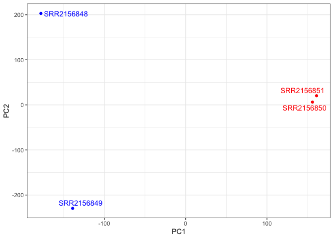
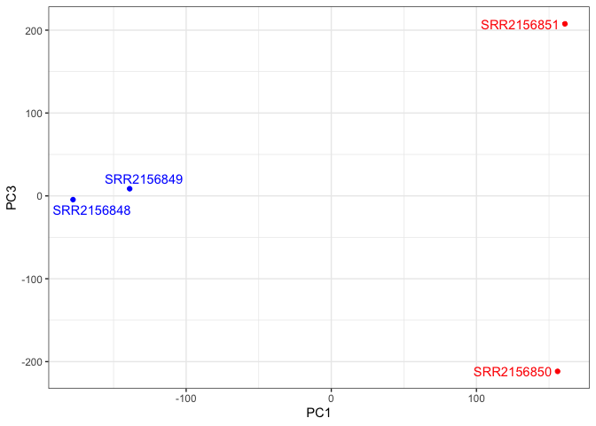
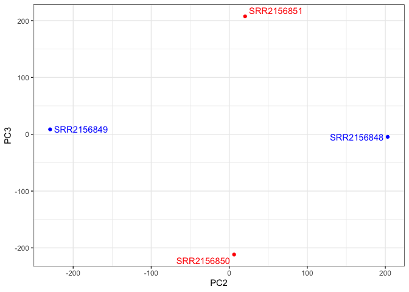

# Class 17: Obtaining and processing SRA datasets on AWS
Cyrus Shabahang (PID:19145663)

# Class 17 Lab

> Q1. What shell command can you use to view the top few lines of your
> FASTQ file?

``` bash
head SRR600956.fastq
```

> Q2. What length are these sequence reads?

The sequence reads are 38 bases long.

> Q3. Can you use the grep command to determine how many total reads are
> in this file?

grep -c “@SRR600956” SRR600956.fastq

This tells us 25849655 total reads.

> Q4. Does your number of reads from grep match the name of the last
> read in the file? If not why not?

grep -c “@SRR600956” SRR600956.fastq

Yes, the number of reads from the grep matches the name of the last read
in the file.

> Q5. How would you check that the .fastq files actually look like what
> we expect for a FASTQ file?

head SRR2156848_1.fastq

> Q6. How could you check the number of sequences in each file?

grep -c “^@SRR2156848” SRR2156848_1.fastq

2959900 sequences in each file.

> Q7. Check your answer with the bottom of the file using tail and also
> check the matching mate pair FASTQ file. Do these numbers match? If so
> why or why not?

tail SRR2156848_1.fastq tail SRR2156848_2.fastq

Yes, these number match.

> Q8. Check you have pairs of FASTQ files for all four datasets and that
> they have the same number of counts in each pair.

ls *.fastq grep -c “^@SRR”* .fastq

> Q9. Fill in the missing kallisto installation/ setup commands

Unzip and untar: tar -zxvf kallisto_linux-v0.44.0.tar.gz

Add kallisto: export PATH=\$PATH:/home/ubuntu/kallisto_linux-v0.44.0

Print citation: kallisto cite

> Q10. Complete the remianing quantification commands

kallisto quant -i hg19.ensembl -o SRR2156849_quant SRR2156849_1.fastq
SRR2156849_2.fastq kallisto quant -i hg19.ensembl -o SRR2156850_quant
SRR2156850_1.fastq SRR2156850_2.fastq kallisto quant -i hg19.ensembl -o
SRR2156851_quant SRR2156851_1.fastq SRR2156851_2.fastq

> Q11. Have a look at the TSV format versions of these files to
> understand their structure. What do you notice about these fils
> contents?

These abudnance.tsv files all contain similar structure for each sample.
Each file has the same transcript-level quantification results.

``` r
library(tximport)
library(ggplot2)
library(ggrepel)
library(rhdf5)
```

Kallisto results:

``` r
folders <- dir(pattern = "SRR21568.*_quant$")
samples <- sub("_quant", "", folders)
files <- file.path(folders, "abundance.h5")
names(files) <- samples

files
```

                         SRR2156848                      SRR2156849 
    "SRR2156848_quant/abundance.h5" "SRR2156849_quant/abundance.h5" 
                         SRR2156850                      SRR2156851 
    "SRR2156850_quant/abundance.h5" "SRR2156851_quant/abundance.h5" 

``` r
txi.kallisto <- tximport(files, type = "kallisto", txOut = TRUE)
```

    1 2 3 4 

``` r
head(txi.kallisto$counts)
```

                    SRR2156848 SRR2156849 SRR2156850 SRR2156851
    ENST00000539570          0          0    0.00000          0
    ENST00000576455          0          0    2.62037          0
    ENST00000510508          0          0    0.00000          0
    ENST00000474471          0          1    1.00000          0
    ENST00000381700          0          0    0.00000          0
    ENST00000445946          0          0    0.00000          0

Counting summaries:

``` r
colSums(txi.kallisto$counts)
```

    SRR2156848 SRR2156849 SRR2156850 SRR2156851 
       2563611    2600800    2372309    2111474 

``` r
sum(rowSums(txi.kallisto$counts) > 0)
```

    [1] 94561

Now let’s filter the transcripts:

``` r
to.keep <- rowSums(txi.kallisto$counts) > 0
kset.nonzero <- txi.kallisto$counts[to.keep,]

keep2 <- apply(kset.nonzero, 1, sd) > 0
x <- kset.nonzero[keep2,]

dim(x)
```

    [1] 94525     4

\#PCA

``` r
pca <- prcomp(t(x), scale = TRUE)
summary(pca)
```

    Importance of components:
                                PC1      PC2      PC3   PC4
    Standard deviation     183.6379 177.3605 171.3020 1e+00
    Proportion of Variance   0.3568   0.3328   0.3104 1e-05
    Cumulative Proportion    0.3568   0.6895   1.0000 1e+00

\##PC1 vs PC2

``` r
mycols <- c("blue", "blue", "red", "red")
ggplot(pca$x) +
  aes(PC1, PC2, label = rownames(pca$x)) +
  geom_point(col = mycols) +
  geom_text_repel(col = mycols) +
  theme_bw()
```



\##PC1 vs PC3

``` r
ggplot(pca$x) +
  aes(PC1, PC3, label = rownames(pca$x)) +
  geom_point(col = mycols) +
  geom_text_repel(col = mycols) +
  theme_bw()
```



\##PC2 vs PC3

``` r
ggplot(pca$x) +
  aes(PC2, PC3, label = rownames(pca$x)) +
  geom_point(col = mycols) +
  geom_text_repel(col = mycols) +
  theme_bw()
```


